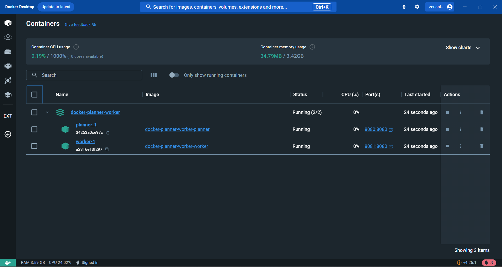
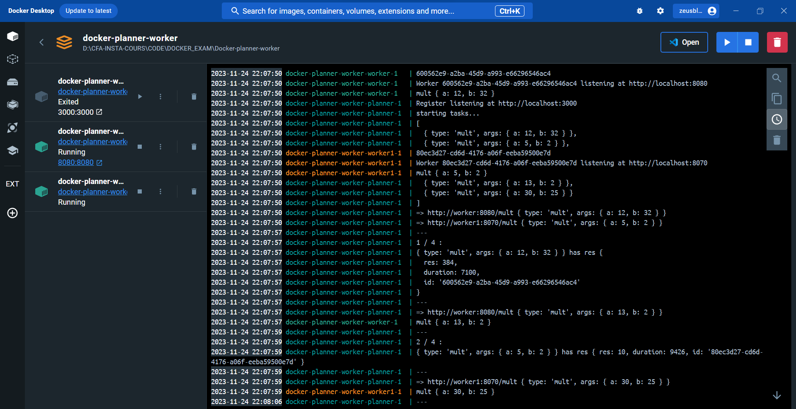
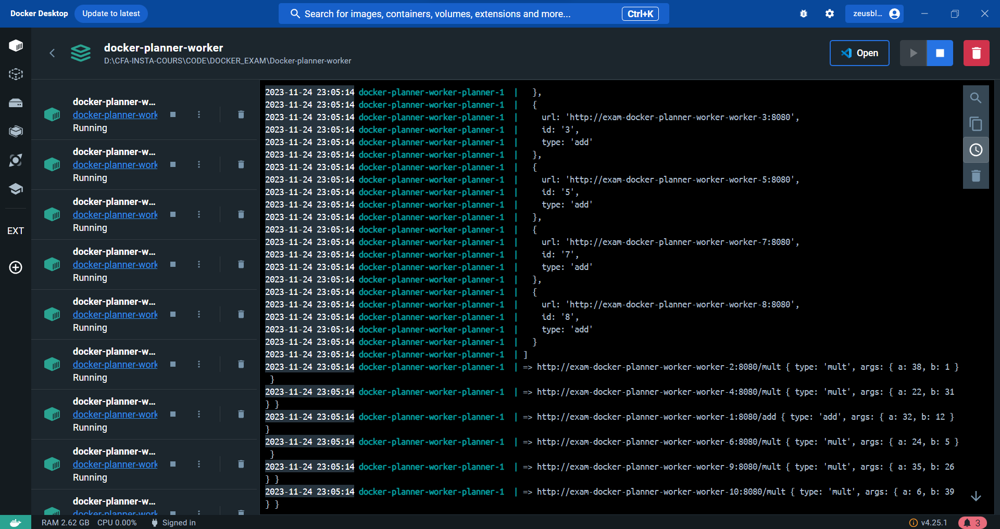
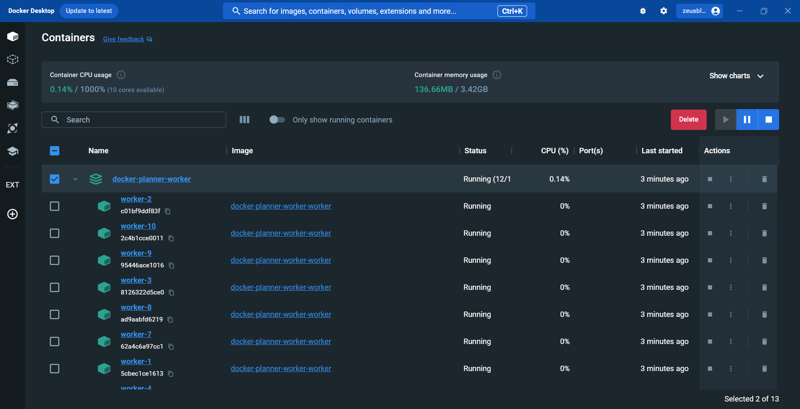

READ.ME

ici vous trouverez les réalisations, exécution sur certains exercices qui nécessitent une explication
ou une commande à utiliser

EXERCICE 1: Dockeriser les ServeurS

    Dans cet il s'agira d'ajouter des fichier Dockerfile contenant les infromations nécssaire
    pour lancer et obtenir nos containers sur notre environnement Docker à savoir: les ports, la version ... 

    - ensuite en éxécute que 4 tâches

_lancemant_de_4_taches.png)

EXERCICE 2: Plusieurs workers 

        -  On veut pouvoir lancer plusieurs workers pour un seul planner pour parallèliser et accélérer l'exécution. Pour ça il vous faudra modifier le code du planner, après avoir modifier la ligne 12 pour initialiser notre 
        tableau de worker comme suit :
        
        let workers = [ 
            { url: 'http://worker:8080', id: '0' },
            { url: 'http://worker1:8070', id: '1' }
            ]

        - modifier notre connect.sh pour insérer une variable dans l'URL comme suit :

        - Buildez vos containers avec docker-compose up - d

        - vous pouviez également vous rendre dans le répertoire du connect.sh et Executer cette commande : 
        [
            ./connect.sh 8081 8082
        ]
        - Si vous avez le message OKOK c'est super !!! vous avez réussi à lancer vous deux workers via votre planner
        - Mais il faudra adapter la code pour passer les port dans les paramètres

EXERCICE 3: Spécialisation des workers
    Il s'agira de :
    - lancez des workers spécialisés et observez le comportement du planner.
    - corrigez les erreurs en modifiant le code du planner.

    Pour ce faire nous allons passer des spécialisations en paramètre au niveau de l'initialisation du tableau de notre workers

        [
            let workers = [
                { url: 'http://worker:8080', id: '0', type: 'mult' },
                { url: 'http://worker1:8070', id: '1', type: 'add' }
            ]
        ]

    

EXERCICE 4: Nombre de worker dynamique
    On repasse avec des workers généraliste. On veut maintenant pouvoir ajouter un nombre dynamique de worker pendant l'exécution du planner.

    Les nouveaux workers fraichement lancés doivent s'enregistrer auprès du planner pour pouvoir recevoir des tâches.

